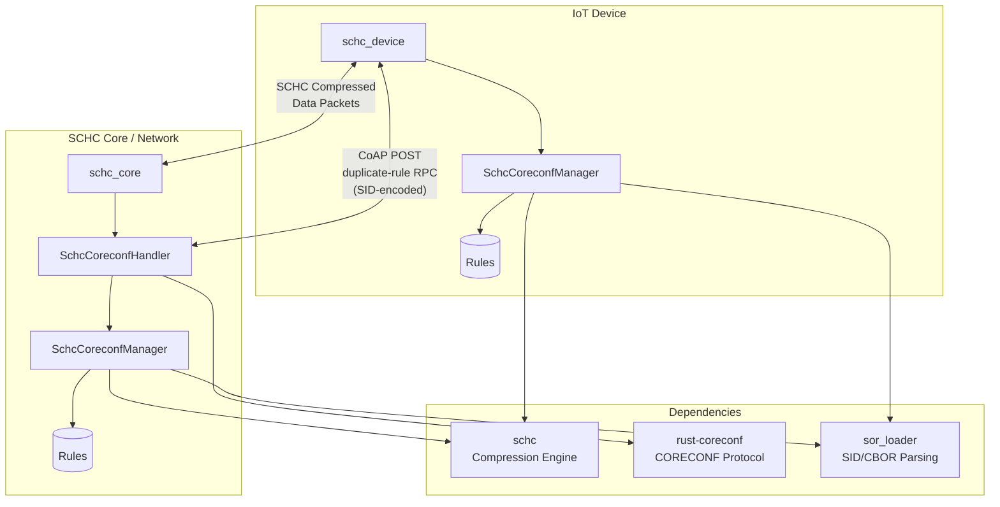

# schc-coreconf

CoRECONF-based rule management for SCHC (Static Context Header Compression).

This crate bridges SCHC compression with CoRECONF, enabling remote management of SCHC rules via CoAP/CBOR using YANG data models per [draft-toutain-schc-coreconf-management](https://datatracker.ietf.org/doc/draft-toutain-schc-coreconf-management/).

## Architecture



## Key Components

| Module                | Purpose                                                                |
| --------------------- | ---------------------------------------------------------------------- |
| `manager.rs`          | Unified SCHC-CoRECONF manager with M-Rules, guard period, and learning |
| `coreconf_adapter.rs` | CoAP request handling and RPC parsing                                  |
| `rpc_builder.rs`      | SID-based RPC encoding for `duplicate-rule`                            |
| `sor_loader.rs`       | Load rules from SOR (CBOR) format with SID mapping                     |
| `m_rules.rs`          | M-Rule management (protected management rules)                         |
| `mgmt_compression.rs` | Compress CORECONF traffic using M-Rules                                |
| `guard_period.rs`     | RTT-based rule synchronization                                         |
| `rule_learner.rs`     | Progressive pattern learning                                           |

## Features

- **M-Rules**: Pre-provisioned rules for compressing CORECONF management traffic
- **SOR Format**: Load rules from efficient CBOR encoding (`.sor` files)
- **SID-Based RPC**: Compact `duplicate-rule` encoding using SID deltas
- **Entry-Index Modifications**: Modify rule fields by index (no FID/POS/DI needed)
- **Guard Period**: RTT-based synchronization for high-latency links
- **Binary Tree Rule IDs**: Helper functions for proper rule derivation
- **Progressive Learning**: Observe traffic patterns and suggest optimized rules

## Quick Start

```bash
# Clone with submodules
git clone --recurse-submodules https://github.com/samsirohi11/schc-coreconf.git
cd schc-coreconf

# Run Core (in terminal 1)
cargo run --example schc_core

# Run Device (in terminal 2)
cargo run --example schc_device
```

## Project Structure

```
schc-coreconf/
├── schc/               # Git submodule: SCHC compression engine
├── coreconf/           # Git submodule: rust-coreconf library
├── src/
│   ├── lib.rs              # Public API exports
│   ├── manager.rs          # Unified SchcCoreconfManager
│   ├── coreconf_adapter.rs # CoAP/CORECONF request handling
│   ├── rpc_builder.rs      # SID-encoded RPC builder
│   ├── sor_loader.rs       # SOR (CBOR) rule loading
│   ├── mgmt_compression.rs # Management traffic compression
│   ├── m_rules.rs          # M-Rule management
│   ├── guard_period.rs     # RTT-based synchronization
│   ├── rule_learner.rs     # Progressive pattern learning
│   ├── identities.rs       # YANG ↔ SCHC identity mappings
│   └── conversion.rs       # YANG ↔ SCHC rule conversion
├── samples/
│   ├── m-rules.json        # M-Rules in JSON format
│   ├── m-rules.sor         # M-Rules in SOR (CBOR) format
│   └── ietf-schc@*.sid     # SID file for YANG mapping
├── rules/
│   ├── base-ipv6-udp.json  # Base rule in JSON
│   └── base-ipv6-udp.sor   # Base rule in SOR format
└── examples/
    ├── schc_core.rs        # Network endpoint example
    └── schc_device.rs      # IoT device example
```

## Usage

### Loading Rules from SOR Format

```rust
use schc_coreconf::{MRuleSet, load_sor_rules};
use rust_coreconf::SidFile;

// Load SID file for YANG mapping
let sid_file = SidFile::from_file("samples/ietf-schc@2026-01-12.sid")?;

// Load M-Rules from SOR (efficient CBOR encoding)
let m_rules = MRuleSet::from_sor("samples/m-rules.sor", &sid_file)?;

// Load application rules
let app_rules = load_sor_rules("rules/base-ipv6-udp.sor", &sid_file)?;
```

### Duplicate-Rule RPC (SID-Encoded)

```rust
use schc_coreconf::rpc_builder::{build_duplicate_rule_rpc, EntryModification};

// Build entry modifications using index addressing
let modifications = vec![
    EntryModification::new(2)  // IPV6.FL
        .with_mo(2900)         // SID for mo-equal
        .with_cda(2920),       // SID for cda-not-sent
    EntryModification::new(7)  // IPV6.DEV_IID
        .with_target_value_bytes(iid.to_vec())
        .with_mo(2900)
        .with_cda(2920),
];

// Build compact SID-encoded RPC
let rpc = build_duplicate_rule_rpc(
    (8, 4),   // source rule
    (8, 5),   // target rule
    Some(&modifications),
);
```

### Manager Setup

```rust
use schc_coreconf::{SchcCoreconfManager, MRuleSet};
use std::time::Duration;

let m_rules = MRuleSet::from_sor("samples/m-rules.sor", &sid_file)?;
let mut manager = SchcCoreconfManager::new(
    m_rules,
    app_rules,
    Duration::from_millis(100),  // RTT estimate
);

// Duplicate a rule with modifications
manager.duplicate_rule(
    (8, 4),
    (8, 5),
    Some(&modifications_json),
)?;
```

## RPC Encoding Comparison

| Format           | Example                                    | Size       |
| ---------------- | ------------------------------------------ | ---------- |
| **JSON strings** | `{"input":{"source-rule-id-value":8,...}}` | ~150 bytes |
| **SID deltas**   | `{5201:{1:8,2:4,3:8,4:5,...}}`             | ~40 bytes  |

The SID-based encoding provides ~70% size reduction for RPC messages.

## References

- [draft-toutain-schc-coreconf-management](https://datatracker.ietf.org/doc/draft-toutain-schc-coreconf-management/) - CORECONF Rule management for SCHC
- [RFC 9363](https://datatracker.ietf.org/doc/rfc9363/) - YANG Data Model for SCHC
- [RFC 8724](https://datatracker.ietf.org/doc/rfc8724/) - SCHC Framework
- [draft-ietf-core-comi](https://datatracker.ietf.org/doc/draft-ietf-core-comi/) - CoRECONF

## License

MIT
