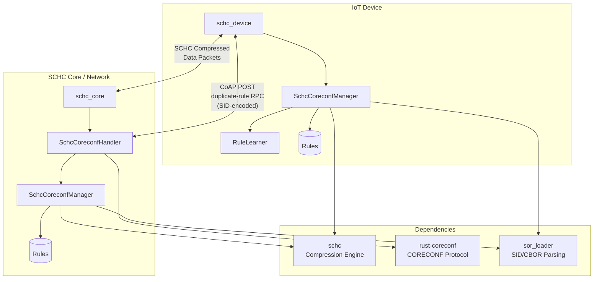

# schc-coreconf

CoRECONF-based rule management for SCHC (Static Context Header Compression).

This crate bridges SCHC compression with CoRECONF, enabling remote management of SCHC rules via CoAP/CBOR using YANG data models per [draft-toutain-schc-coreconf-management](https://datatracker.ietf.org/doc/draft-toutain-schc-coreconf-management/) with some optimizations.

## Architecture



## Working Model

### Rule Hierarchy

The system uses a layered rule approach:

1. **M-Rules (Management Rules)**: Pre-provisioned, immutable rules for compressing CoRECONF management traffic itself. These ensure efficient RPC transmission even before application rules are optimized.

2. **Base Rules**: Generic application rules with flexible matching (e.g., `ignore` + `value-sent` for variable fields). Serve as templates for derivation.

3. **Derived Rules**: Flow-specific rules created from base rules with tighter matching. Fields observed to be constant are converted from `value-sent` to `not-sent`, reducing transmission overhead.

### Rule Derivation Flow

```
┌─────────────────┐     observe packets     ┌─────────────────┐
│   Base Rule     │ ────────────────────►   │   RuleLearner   │
│   8/4           │                         │                 │
│ FL: ignore      │                         │ Detects:        │
│ IID: value-sent │                         │ - FL constant   │
│ Port: value-sent│                         │ - IID constant  │
└─────────────────┘                         │ - Port constant │
                                            └────────┬────────┘
                                                     │ suggest
                                                     ▼
┌─────────────────┐     duplicate-rule      ┌─────────────────┐
│  Derived Rule   │ ◄────────────────────   │  Suggested Rule │
│   8/5           │        RPC              │                 │
│ FL: equal/      │                         │ Modifications:  │
│     not-sent    │                         │ - FL → not-sent │
│ IID: equal/     │                         │ - IID → not-sent│
│     not-sent    │                         │ - Port→ not-sent│
└─────────────────┘                         └─────────────────┘
```

### Learning Mode

The RuleLearner observes packet field values and detects constant patterns:

1. **Observation**: Each packet's field values are recorded (excluding computed fields like length/checksum)
2. **Pattern Detection**: After N packets, fields with 100% constant values are identified
3. **Rule Suggestion**: Constant fields are converted from `value-sent` to `not-sent` with the observed value as target
4. **Provisioning**: The optimized rule is sent to the peer via `duplicate-rule` RPC and applied locally

This enables progressive optimization without prior knowledge of traffic patterns.

### Rule ID Allocation

Derived rules follow a binary tree structure per the draft specification:

```
Base Rule: 8/4 (binary: 1000)
    ├── 8/5  (binary: 01000) - append 0
    └── 24/5 (binary: 11000) - append 1
        ├── 24/6 (binary: 011000) - append 0
        └── 56/6 (binary: 111000) - append 1
```

The manager uses BFS allocation to find available rule IDs, providing balanced tree growth and avoiding conflicts.

### Guard Period

Rule modifications require synchronization between endpoints. The guard period (based on RTT estimate) ensures:

- **New rules**: Immediately active (no guard period)
- **Modified rules**: Candidate state during guard period, then active
- **Deleted rules**: Rule ID blocked during guard period to prevent reuse conflicts

## Key Components

| Module                | Purpose                                                                |
| --------------------- | ---------------------------------------------------------------------- |
| `manager.rs`          | Unified SCHC-CoRECONF manager with M-Rules, guard period, and learning |
| `coreconf_adapter.rs` | CoAP request handling and RPC parsing                                  |
| `rpc_builder.rs`      | SID-based RPC encoding for `duplicate-rule`                            |
| `sor_loader.rs`       | Load rules from SOR (CBOR) format with SID mapping                     |
| `m_rules.rs`          | M-Rule management (protected management rules)                         |
| `mgmt_compression.rs` | Compress CORECONF traffic using M-Rules                                |
| `guard_period.rs`     | RTT-based rule synchronization                                         |
| `rule_learner.rs`     | Progressive pattern learning for automatic rule optimization           |

## Features

- **M-Rules**: Pre-provisioned rules for compressing CORECONF management traffic
- **SOR Format**: Load rules from efficient CBOR encoding (`.sor` files)
- **SID-Based RPC**: Compact `duplicate-rule` encoding using SID deltas
- **Entry-Index Modifications**: Modify rule fields by index (no FID/POS/DI needed)
- **Guard Period**: RTT-based synchronization for high-latency links
- **Binary Tree Rule IDs**: BFS allocation for proper rule derivation
- **Learning Mode**: Observe traffic patterns and automatically suggest optimized rules

## Quick Start

```bash
# Clone with submodules
git clone --recurse-submodules https://github.com/samsirohi11/schc-coreconf.git
cd schc-coreconf

# Run Core (in terminal 1)
cargo run --example schc_core

# Run Device (in terminal 2)
cargo run --example schc_device
```

### Device Commands

The interactive device example supports:

| Command     | Description                                              |
| ----------- | -------------------------------------------------------- |
| `send [N]`  | Send N packets (default 5) using best available rule     |
| `derive`    | Manually derive optimized rule (hardcoded modifications) |
| `learn [N]` | Enable learning mode (auto-derive after N packets)       |
| `learn off` | Disable learning mode                                    |
| `rules`     | Show current rules and learning status                   |
| `help`      | Show available commands                                  |
| `quit`      | Exit                                                     |

**Learning mode** observes field values across packets and automatically derives a rule when constant patterns are detected.

## Project Structure

```
schc-coreconf/
├── schc/               # Git submodule: SCHC compression engine
├── coreconf/           # Git submodule: rust-coreconf library
├── src/
│   ├── lib.rs              # Public API exports
│   ├── manager.rs          # Unified SchcCoreconfManager
│   ├── coreconf_adapter.rs # CoAP/CORECONF request handling
│   ├── rpc_builder.rs      # SID-encoded RPC builder
│   ├── sor_loader.rs       # SOR (CBOR) rule loading
│   ├── mgmt_compression.rs # Management traffic compression
│   ├── m_rules.rs          # M-Rule management
│   ├── guard_period.rs     # RTT-based synchronization
│   ├── rule_learner.rs     # Progressive pattern learning
│   ├── identities.rs       # YANG ↔ SCHC identity mappings
│   └── conversion.rs       # YANG ↔ SCHC rule conversion
├── samples/
│   ├── m-rules.json        # M-Rules in JSON format
│   ├── m-rules.sor         # M-Rules in SOR (CBOR) format
│   └── ietf-schc@*.sid     # SID file for YANG mapping
├── rules/
│   ├── base-ipv6-udp.json  # Base rule in JSON
│   └── base-ipv6-udp.sor   # Base rule in SOR format
└── examples/
    ├── schc_core.rs        # Network endpoint example
    └── schc_device.rs      # IoT device example
```

## Usage

### Loading Rules from SOR Format

```rust
use schc_coreconf::{MRuleSet, load_sor_rules};
use rust_coreconf::SidFile;

// Load SID file for YANG mapping
let sid_file = SidFile::from_file("samples/ietf-schc@2026-01-12.sid")?;

// Load M-Rules from SOR (efficient CBOR encoding)
let m_rules = MRuleSet::from_sor("samples/m-rules.sor", &sid_file)?;

// Load application rules
let app_rules = load_sor_rules("rules/base-ipv6-udp.sor", &sid_file)?;
```

### Manager with Learning

```rust
use schc_coreconf::SchcCoreconfManager;
use std::time::Duration;

let mut manager = SchcCoreconfManager::new(
    m_rules,
    app_rules,
    Duration::from_millis(100),  // RTT estimate
);

// Enable learning mode (suggest after 5 packets)
manager.enable_learning(5);

// Observe packets during compression
for packet in packets {
    let fields = extract_fields(&packet);
    manager.observe_packet(&fields);
}

// Check for suggestions
if manager.has_suggestion() {
    if let Some(rule) = manager.suggest_rule() {
        // Send RPC to peer and provision locally
        manager.provision_rule(rule)?;
    }
}
```

### Duplicate-Rule RPC (SID-Encoded)

```rust
use schc_coreconf::rpc_builder::{build_duplicate_rule_rpc, EntryModification};

// Build entry modifications using index addressing
let modifications = vec![
    EntryModification::new(2)  // IPV6.FL
        .with_mo(2900)         // SID for mo-equal
        .with_cda(2920),       // SID for cda-not-sent
    EntryModification::new(7)  // IPV6.DEV_IID
        .with_target_value_bytes(iid.to_vec())
        .with_mo(2900)
        .with_cda(2920),
];

// Build compact SID-encoded RPC
let rpc = build_duplicate_rule_rpc(
    (8, 4),   // source rule
    (8, 5),   // target rule
    Some(&modifications),
);
```

### Rule ID Allocation

```rust
// Find next available rule ID using BFS
let base_rule = (8, 4);
if let Some((id, len)) = manager.find_next_available_rule_id(base_rule) {
    println!("Available: {}/{}", id, len);  // e.g., 8/5 or 24/5
}

// Allocate and reserve
if let Some(rule_id) = manager.allocate_rule_id(base_rule) {
    // rule_id is now marked as known, won't be suggested again
}
```

## RPC Encoding Comparison

| Format           | Example                                    | Size       |
| ---------------- | ------------------------------------------ | ---------- |
| **JSON strings** | `{"input":{"source-rule-id-value":8,...}}` | ~150 bytes |
| **SID deltas**   | `{5201:{1:8,2:4,3:8,4:5,...}}`             | ~40 bytes  |

The SID-based encoding provides ~70% size reduction for RPC messages.

## Compression Efficiency

With learned rules, header compression improves significantly:

| Traffic Type      | Base Rule | Derived Rule | Improvement |
| ----------------- | --------- | ------------ | ----------- |
| IPv6/UDP headers  | ~60%      | ~90%         | +30%        |
| CORECONF (M-Rule) | ~85%      | N/A          | Built-in    |

## References

- [draft-toutain-schc-coreconf-management](https://datatracker.ietf.org/doc/draft-toutain-schc-coreconf-management/) - CORECONF Rule management for SCHC
- [RFC 9363](https://datatracker.ietf.org/doc/rfc9363/) - YANG Data Model for SCHC
- [RFC 8724](https://datatracker.ietf.org/doc/rfc8724/) - SCHC Framework
- [draft-ietf-core-comi](https://datatracker.ietf.org/doc/draft-ietf-core-comi/) - CoRECONF

## License

MIT
