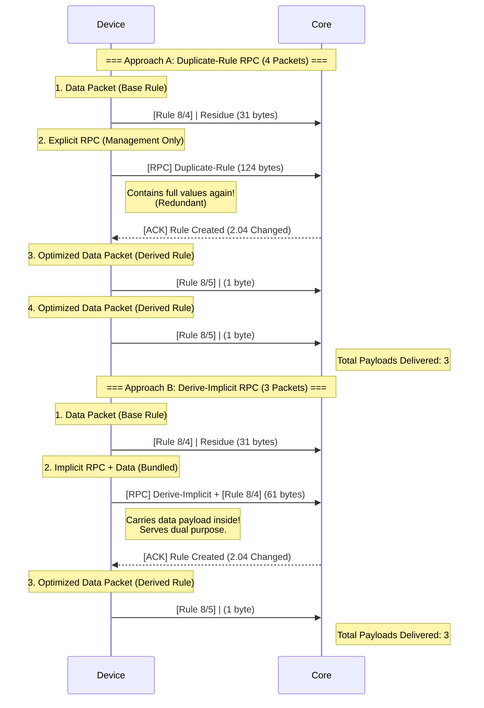

# Packet Flow: RPC Approaches Comparison

**Objective:** Compare the byte overhead and packet structure of two rule derivation approaches.

## 1. Sequence Diagram: Side-by-Side

## 2. Byte Usage Comparison

| Step                      | Approach A: Duplicate-Rule | Approach B: Derive-Implicit   |
| :------------------------ | :------------------------- | :---------------------------- |
| **1. Data (Initial)**     | **31 bytes** (Rule 8/4)    | **31 bytes** (Rule 8/4)       |
| **2. Transition**         | **124 bytes** (RPC only)   | **61 bytes** (RPC + Data 8/4) |
| **3. Data (Optimized)**   | **1 byte** (Rule 8/5)      | **1 byte** (Rule 8/5)         |
| **4. Data (Equivalence)** | **1 byte** (Rule 8/5)      | — (N/A)                       |
| **Total Bytes**           | **157 bytes**              | **93 bytes**                  |
| **Comparison**            | Baseline                   | **~41% Total Savings**        |

### Key Differences

- **Approach A (Duplicate-Rule):** The transition step (RPC) is purely management overhead (124 bytes) and requires re-sending the field values. To deliver 3 data payloads, it must send 4 separate packets (1 initial, 1 RPC, 2 optimized).
- **Approach B (Derive-Implicit):** The transition step (RPC) **bundles** the data packet inside. The 61 bytes includes _both_ the derivation request AND the data payload. To deliver 3 data payloads, it only needs 3 packets, eliminating 1 entire transmission and significant byte overhead.
